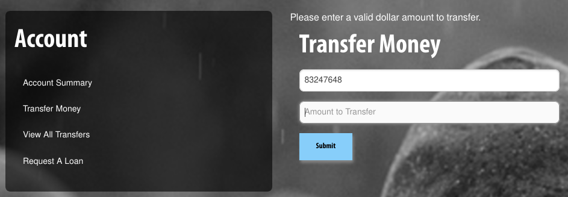
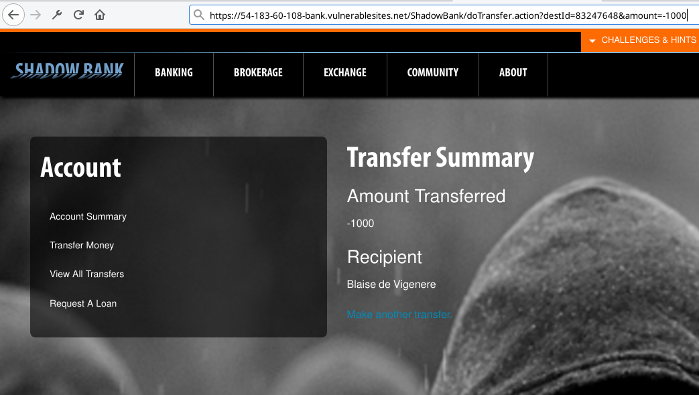
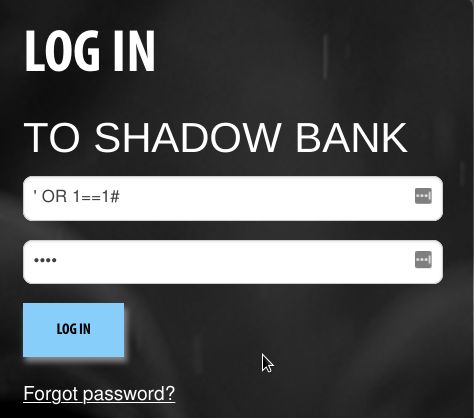
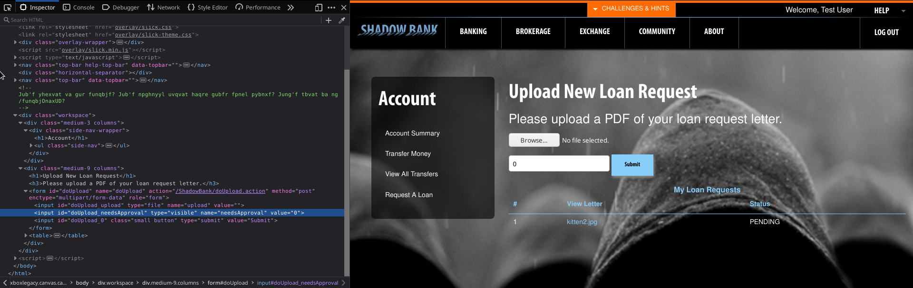
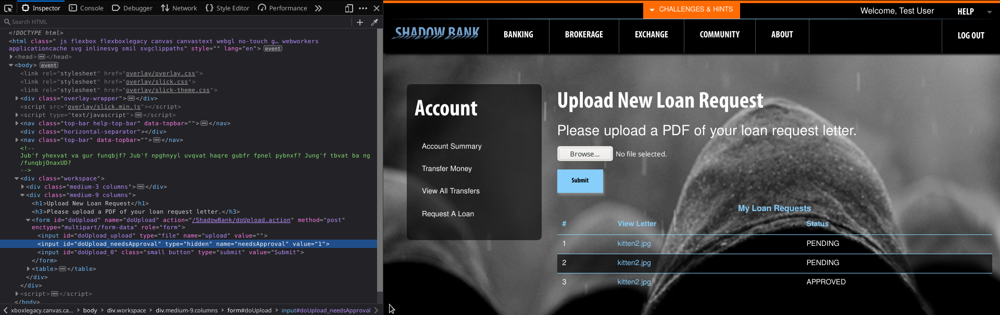
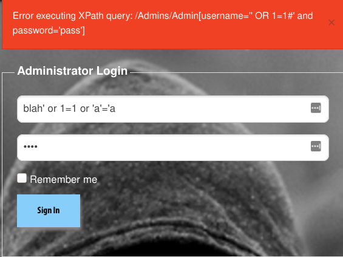

# **CMD+CTRL**

I got participate in a recent beginner friendly ~~for cat lovers~~ CTF. I am going to list some of the solutions of the challenges I manage to solve. The system was automatically awarding points based on difficulty. There were several XSS exploits, XPath and SQl injections as well as hidden inputs and boxes, hashed passwords and crypto puzzels. 

### *Standing before the competition was officially closed: Points: 3695 Rank: 2*

## **Objective**
**Financial<br>**
**Shadow Bank**


Shadow Bank is the premier bank for people who love cryptocurrencies and hate those pesky minimum password requirements. Transfer money, request a loan, or buy and sell stocks and currencies.


---
1. Getting to log-in was easy. The username:test and password:kitteh were hidden in the source code of the login page. (Inspect Element)

2. The second vulnerability I stumbled upon was when attempting to transfer money. 
    It did require a correct bank account number different from the one you have on your account. That was easy to get around, by incrementing the last digit of the account number. Upon submitting it the query was exposed.
    ```
    https://54-183-60-108-bank.vulnerablesites.net/ShadowBank/doTransfer.action?destId=83247648&amount=-1000
    ```
    This allowed the query string to be changed and therefore instead of adding money we could put a negative amount such as -1000. 
    
    
3. Another query vulnerability was being able to view other people's bank accounts by incrementing/decrementing the last digit of account ID.
   ```
   https://54-183-60-108-bank.vulnerablesites.net/ShadowBank/brokerageDetails?user=83247643
   ```
4. Chcecking the roboots.txt revealed another path /debug.
    ```
    https://54-183-60-108-bank.vulnerablesites.net/ShadowBank/robots.txt

    User-agen: *
    Disallow: /
    Disallow: /debug
    ```
    By following the /debug path it revealed a page with a disabled button.
    Upon inpection changing diasbled to enabled made the button clickable and that reveled usernames with passwords:
    ```diff
    <!-- Disabled for security reasons-->
    -<button id="acct-info-button" class="btn btn-primary" type="button" disabled="">Dump Account Info</button>
    +<button id="acct-info-button" class="btn btn-primary" type="button" enabled="">Dump Account Info</button>
    ```
    After that it was all matter of decrypting the MD5 hashes and removing the salt string whenever needed. Offlin command line tool that can do that is johntheripper.
    |Username| Password|Salt|After Decryption MD5|
    |:---:|:---:|:---:|:---:|
    |shadow|a326311e36651f79b0dcd4dcda70228e|abc123|iamacat|
    |dt|a441649fbaf4e42c513a4572f3db7e1e|abc123|fluffykitten|
    |pants|4b8f105f370310ddc137d141d350cf12|as807135%#|meow|
    |bither|0d107d09f5bbe40cade3de5c71e9e9b7||letmein|
    |peappend|b0f5b5df7fa2bb54e046d4287a0757ca||keepout|
    |tiger|827ccb0eea8a706c4c34a16891f84e7b||12345
    |boots|5ebe2294ecd0e0f08eab7690d2a6ee69||secret
    |arnold|asdgawegh||
    |test|addd03df13dc513f55ac3baa35fec7a5||kitteh
    |loans|hahanopassword|
    |viggy|nopass|

5. Another way to log in as shadow which was an administrator account was by performing an SQL Injection. 
   
   Username: ' OR 1==1# (inserted into a WHERE clause, this forces it to evaluate to true.
   )

   Password: random string

   

6. It was possible to automatically get Loan Request approved. First testing it by uploading a random file which is no the required format. After inspecting how the page changed after uploading it. There was a hidden input field, which accepts a value of 1 for *PENDING* and 0 for *APPROVED*
   ```diff
   -<input id="doUpload_needsApproval"" type="hidden" name="needsApproval" value="1">
   +<input id="doUpload_needsApproval"" type="visible" name="needsApproval" value="0">
   ```
   
    
    

7. There was another path which was not noted in the robots.txt, /admin.
    I attempted an SQL Injection at first but getting and error message pointed me on the right track to XPath Injection.</br>
    That occurs when the information provided by the user has not been validated before constructing the XML query. The following example in C# shows how that works. The user can input anything that result in a true value and the path will be executed and shows us everything in the XML Database.
    ```C#
    String FindUserXPath;
    FindUserXPath = "//Employee[UserName/text()='" + Request("Username") + "' And 
        Password/text()='" + Request("Password") + "']";
    ```
    

---

## **Ciphers**
    I managed to find two ciphers. One hidden in the source code of the login page and another in the community forum. 

## *Ceaser* Cipher with an offset of 20.
    ```
    <!--Jub'f yhexvat va gur funqbjf? Jub'f npghnyyl uvqvat haqre gubfr fpnel pybnxf? Jung'f tbvat ba ng /funqbjOnaxUD?-->

    Who's lurking in the shadows? Who's actually hiding under those scary cloaks? What's going on at /shadowBankHQ?
    ```
## *Vigenere* Cipher with a keyword riddle.
    ```
    kph flx fvob rvzvqho aymq le wre dotgv. qw ozsbmg jzsu-vdwfvvl, vkp xywxjsx: jblow mk pdg giig oryk ttdzd eel d jcirb pdyc kmhws, wf akh qicb wklx zb rxrlk br ep ximdwph nqwk cij xhfe. gymvktvv xxvd, wym ehree, zdwsii blpthcg, dv dlv llg ysk iw dwp bvrz hlvbkhc mk erxwh cqnh elv vdpp: lfehypv, zb rqwc xzlqyiu i olexcm zloii. krpp, mka sopejmg vz jrz, wkzyx pw dwmtm, dqo wym zhyx fv. zrfpu grx eict ph, apvivh, hlzkk zlc z wxjsx kw jr qvfu khci? kpdw oigmqgd e xwrg oirt rq hlvzh bzy niqw es xmw wz, wrqg wsi tiw. l oseb pxnl tiuh hlvzh— vlmu iolni. kphq tx uwhvyx diwwpv nplfs arg brf kf, adlo xym fde. —wf trqr ej q jhe wfuhzsiim, dotgv iggph ra dq pbgtdqlxzwq. rs, cfcuh dyim wr os kpdw, dezl wkp grb, li jsl wqoj artn ozrx mqrfky. iolni wmow elrb wktw twxoo rfb eh oieqhg, ds jph wcmvl dqzxymu tfijblry. ayiw vzvk wi spsgth otzv ierfx ymuh? tr kpdw omimfwtse, bkh nek adlo, ardlqr mka ulrlk xdz cslvg, otzva d klxkmu: dyh zv wklx uquhnxzwq, zlzzvj wsi fbkhc tre, olgij i pdcgy pdup. zzalw pmkphu jsl tlnp: xymbup ffbk plh. scw l oseb zdyx kw jr lqfvj plh gmrswi, rtlfp vvuduviu. wk, bzy tiqw sicx wklx, jilg elv kdw: hiim dow qrl khci. zu pdo. cfcuh xeu. prz os pwx nysn qp plh? jilg lpzkh. bzy dcvw mi, jilg elv kdw, zv pwx zzyclqw semm frxi ymuh. /dlrlrzmees/fkpwyquh


    the cat only grinned when it saw alice. it looked good-natured, she thought: still it had very long claws and a great many teeth, so she felt that it ought to be treated with res pect. cheshire puss, she began, rather timidly, as she did not at all know whether it would like the name: however, it only grinned a little wider. come, its pleased so far, thoug ht alice, and she went on. would you tell me, please, which way i ought to go from here? that depends a good deal on where you want to get to, said the cat. i dont much care where— said alice. then it doesnt matter which way you go, said the cat. —so long as i get somewhere, alice added as an explanation. oh, youre sure to do that, said the cat, if you only walk long enough. alice felt that this could not be denied, so she tried another question. what sort of people live about here? in that direction, the cat said, waving its right paw round, lives a hatter: and in that direction, waving the other paw, lives a march hare. visit either you like: theyre both mad. but i dont want to go among mad people, alice remarked. oh, you cant help that, said the cat: were all mad here. im mad. youre mad. how do you know im mad? said alice. you must be, said the cat, or you wouldnt have come here. /shadowbank/cheshire
    ```